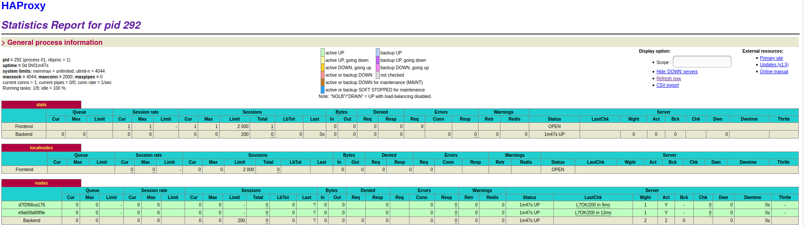

## AIT - January 2020
# Lab 04 - Docker
### Julien Huguet & Antoine Hunkeler

#### Table of contents

- [1. Introduction](#1-introduction)
- [2. Tasks](#2-tasks)
  - [2.1. Task 0](#21-task-0---indentify-issues-and-install-the-tools)
  - [2.2. Task 1](#22-task-1---add-a-process-supervisor-to-run-several-processes)
  - [2.3. Task 2](#23-task-2---add-a-tool-to-manage-membership-in-the-web-server-cluster)                
  - [2.4. Task 3](#24-task-3--react-to-membership-changes)
  - [2.5. Task 4](#25-task-4--use-a-template-engine-to-easily-generate-configuration)
  - [2.6. Task 5](#26-task-5--generate-a-new-load-balancer-configuration-when-membership-changes)
  - [2.7. Task 6](#27-task-6--make-the-load-balancer-automatically-reload-the-new-configuration)
- [3. Difficulties](#3-difficulties)
- [4. Conclusion](#4-conclusion)

#### 1. Introduction

The goal of this lab is to perform some tasks to experiment some experiences with Docker. Here is the situation : we have a load balancer listening on port 80 using HAProxy and Docker containers with a NodeJS application listening on port 3000 that represent the backend nodes.

Imagine some days the load balancer receive a lot of traffic : the infrastructure will be able to add several Docker containers with Web applications when there is a huge traffic and delete some Docker containers when the traffic goes normal. It is like an infrastructure with vertical scalability.

It exists some tools to accomplish this task, but we will use the softwares S6 and Serf. In this lab, we used HAProxy version 1.5, Docker version 18.09.7, build 2d0083d and Docker Compose version version 1.24.1, build 4667896b.

In this report, we do not rewrite the instructions of each task, but only the deliverables including the questions.

#### 2. Tasks

#### 2.1. Task 0 - Indentify issues and install the tools

##### *1. Take a screenshot of the stats page of HAProxy at http://192.168.42.42:1936. You should see your backend nodes.*


In this screenshot, we can see that there is only two backnodes (`s1` and `s2`) because the command `docker-compose up --build` build images and create Docker containers for HAProxy load balancer and the two backend nodes.

##### *2. Give the URL of your repository URL in the lab report.*

[Link of our GitHub repo](https://github.com/zereddiamond/Teaching-HEIGVD-AIT-2019-Labo-Docker)

#### 2.2. Task 1 - Add a process supervisor to run several processes

This task answers to the question M5 : 

>"In the physical or virtual machines of a typical infrastructure we tend to have not only one main process (like the web server or the load balancer) running, but a few additional processes on the side to perform management tasks.
For example to monitor the distributed system as a whole it is common to collect in one centralized place all the logs produced by the different machines. Therefore we need a process running on each machine that will forward the logs to the central place. (We could also imagine a central tool that reaches out to each machine to gather the logs. That's a push vs. pull problem.) It is quite common to see a push mechanism used for this kind of task.
Do you think our current solution is able to run additional management processes beside the main web server / load balancer process in a container? If no, what is missing / required to reach the goal? If yes, how to proceed to run for example a log forwarding process? "

The answer of this question is the goal of this task : we will install a tool that allowes to execute multiple processes in a Docker container. Because containers can run one process, a process supervisor should be installed. In this task, we will install the `S6` software.

##### *1. Take a screenshot of the stats page of HAProxy at http://192.168.42.42:1936. You should see your backend nodes. It should be really similar to the screenshot of the previous task.*


As we can see, there is no change about previous point, so the two backend nodes are still running.

##### *2. Describe your difficulties for this task and your understanding of what is happening during this task. Explain in your own words why are we installing a process supervisor. Do not hesitate to do more research and to find more articles on that topic to illustrate the problem.*

Our difficulties is to find a good explanation about what is a process supervisor and try to explain in summary what is the goal of a process supervisor. No difficulties about the task.

Our understanding is, in this task, we install a little software called `S6` that allows to run multiple processes in a Docker container.

A process supervisor is a system that allows to control the number of processes in a Linux system. It can be useful where we need some applications to start and available permanently.

Normally, there is one process (or service) per Docker container given by the `ENTRYPOINT` or `CMD` instructions in Dockerfile it must be only one of these instructions in this file.

The reason why we need a process supervisor in our lab is because our containers will be able to run multiple tasks, for example the `ha` container for HAProxy service must running applications and make management of infrastructure and writing in logs without interrupt main process.

#### 2.3. Task 2 - Add a tool to manage membership in the web server cluster

In this task, the main activity is to install and configure a software called `Serf` that allows to exchange information in every container when there is a particular event (like a node appears or disappears). It can be more dynamic.

##### *1. Provide the `docker log` output for each of the containers: `ha`, `s1` and `s2`. You need to create a folder `logs` in your repository to store the files separately from the lab report. For each lab task create a folder and name it using the task number. No need to create a folder when there are no logs.*

Wheb we start the `ha` container with `docker run` command ([complete log file here](../logs/task2/logs_serf_ha_docker_run.log)), we can see there is still the event that the event `EventMemberJoin` is triggered, but there is some errors about call the script `member-join.sh`.

The only reason is that the script `member-join.sh` does not exist anymore!!!

This is the same errors when other nodes try to join the cluster and for nodes's log files and other log files of containers launching with `docker-compose up --build` command (not in this list, but in the `logs` folder) :

- [ha container logs when s1 try to join](../logs/task2/logs_serf_ha_docker_run_after_start_s1.log)

- [ha container logs when s2 try to join](../logs/task2/logs_serf_ha_docker_run_after_start_s2.log)

- [s1 container logs with docker run](../logs/task2/logs_serf_s1_docker_run.log)

- [s2 container logs with docker run](../logs/task2/logs_serf_s2_docker_run.log)

- [s1 container logs with docker run without ha container](../logs/task2/logs_serf_s1_docker_run_before_ha.log)

- [s2 container logs with docker run without ha container](../logs/task2/logs_serf_s2_docker_run_before_ha.log)

In the last two log files, we can notice almost at the end the message `"No such host"`, because the nodes cannot find a host with a proxy.

##### *2. Give the answer to the question about the existing problem with the current solution.*

To recall, here is the question : 

>"You probably noticed that the list of web application nodes is hardcoded in the load balancer configuration. How can we manage the web app nodes in a more dynamic fashion?"

We can use the `Serf` software that allows to exchange the information between all nodes, but we can notice in the logs there is some errors in `ha` logs, because there is not the mecanism to add in HAProxy config file the presence of some web app nodes.

Fortunately, we have already the `S6` software to allows run multiple processes in a container and `Serf` software to analyse the actual state of our containers.

It miss some scripts that allows automatically add a new node in the cluster and notify the HAProxy config file that there is a new node or he leaves the cluster.

##### *3. Give an explanation on how Serf is working. Read the official website to get more details about the GOSSIP protocol used in Serf. Try to find other solutions that can be used to solve similar situations where we need some auto-discovery mechanism.*

Serf sends periodically messages with UDP protocol between nodes and uses the Gossip protocol to resolve three problems : membership changes, failed nodes and recorvery and customed messages propagation.

Gossip protocol allows to broadcast messages in the nodes cluster. He is based on an another protocol called SWIM (Scalable Weakly-consistent Infection-style Process Group Membership Protocol).

This protocol works with a concept of cluster that reprensents a group of nodes. Serf joins an existing cluster or can create a new one. When a new node joins the cluster, he receive an address from at least one existing member to join the cluster.

After that, the new member make a state synchronisation with the existing member with TCP.

Gossip is based with the SWIM protocol, but there is minors modifications, especially that Serf uses TCP for make a full state synchronisation periodically and have a dedicated layer separated from the failure detection protocol and keep the dead nodes during a determinate timer.

Serf uses specific messages like `leave indent` when a node quits a cluster, `join indent` when a new node joins a cluster, `user event` and `user query` when node sends any events and queries. All of this messages go through the gossip layer.

It exists some other softwares that can replace Serf : ZooKeeper, doozerd, etcd, Chef, Puppet, Fabric and Consul. But Serf have some improvements compared to these softwares.

#### 2.4. Task 3 : React to membership changes

In this task, we completely answer to the issue M4 : 

> "You probably noticed that the list of web application nodes is hardcoded in the load balancer configuration. How can we manage the web app nodes in a more dynamic fashion?"

About this issue, thanks to the `Serf`, we implemented two scripts `member-join.sh` and `member-leave.sh` that allow to put a message in a log file when a container joins or leaves the cluster.

It makes the infrastructure more dynamic.

##### *1. Provide the docker log output for each of the containers: ha, s1 and s2. Put your logs in the logs directory you created in the previous task.*

Here is an extract of the [log file](../logs/task3/logs_ha_after_docker_run.log) (the complete version is available when click on this link) of the node `ha` at startup : 

```
(...)
==> Starting Serf agent...
==> Starting Serf agent RPC...
==> Serf agent running!
         Node name: 'd027ada968fc'
         Bind addr: '0.0.0.0:7946'
          RPC addr: '127.0.0.1:7373'
         Encrypted: false
          Snapshot: false
           Profile: lan
(...)

    2019/12/27 13:17:37 [INFO] agent: Serf agent starting
    2019/12/27 13:17:37 [INFO] serf: EventMemberJoin: d027ada968fc 192.168.42.2
    2019/12/27 13:17:37 [INFO] agent: joining: [ha] replay: true
    2019/12/27 13:17:38 [INFO] agent: Received event: member-join
    2019/12/27 13:17:39 [INFO] agent: joined: 1 nodes
```

We can see that there is some information about this node, like his name and IP address including port. There is no nodes joining the cluster, except hitself.

Here is the log after starting the node s1 ([complete log file here](../logs/task3/logs_ha_after_s1_start.log)): 
```
(...)

    2019/12/27 13:17:37 [INFO] agent: Serf agent starting
    2019/12/27 13:17:37 [INFO] serf: EventMemberJoin: d027ada968fc 192.168.42.2
    2019/12/27 13:17:37 [INFO] agent: joining: [ha] replay: true
    2019/12/27 13:17:38 [INFO] agent: Received event: member-join
    2019/12/27 13:17:39 [INFO] agent: joined: 1 nodes
    2019/12/27 13:20:20 [INFO] serf: EventMemberJoin: c785a498d137 192.168.42.3
    2019/12/27 13:20:21 [INFO] agent: Received event: member-join
```

We can see at the end the Serf agent in ha node receives a new event that there is a new node joining the cluster with a specific address and a name. It corresponds to the backend node `s1`.

Here is the log after startup the s1 node ([complete log file here](../logs/task3/logs_s1_after_docker_run.log)) : 

```
(...)
         Node name: 'c785a498d137'
         Bind addr: '0.0.0.0:7946'
          RPC addr: '127.0.0.1:7373'
         Encrypted: false
          Snapshot: false
           Profile: lan

(...)

    2019/12/27 13:20:18 [INFO] agent: Serf agent starting
    2019/12/27 13:20:18 [INFO] serf: EventMemberJoin: c785a498d137 192.168.42.3
    2019/12/27 13:20:18 [INFO] agent: joining: [ha] replay: false
    2019/12/27 13:20:19 [INFO] agent: Received event: member-join
    2019/12/27 13:20:20 [INFO] serf: EventMemberJoin: d027ada968fc 192.168.42.2
    2019/12/27 13:20:20 [INFO] agent: joined: 1 nodes
    2019/12/27 13:20:21 [INFO] agent: Received event: member-join
```

We can see that this node can see what happen in the cluster : firstly the `ha` node joining and after that, himself joining the cluster.

At the beginning of each log file, we can see that the `S6` software starts, so it can be multiple processes in the Docker container (one process for HAProxy and another one to write in log file for example.)

##### *2. Provide the logs from the ha container gathered directly from the /var/log/serf.log file present in the container. Put the logs in the logs directory in your repo.*

Here is the log inside the `ha` node : 

```
Member join script triggered
Member join event received from: d027ada968fc with role balancer
Member join script triggered
Member join event received from: c785a498d137 with role backend
```

We can notice that the first event Member join is the ha node identified with `d027ada968fc` with the role of balancer, so the role of load balancing.

And the second event Member join is the node s1 identified with `c785a498d137` with the role of a backend node.

This is because the `member-join.sh` script wrote a message `"Member join script triggered"`  in every call of this script, so each time new container joins the cluster, and after that, the script takes some parameters, like his IP address, hostname and rule and writes all of that in the log file.

It is the same process for the script `member-leave.sh`, but it can accept the two events.

#### 2.5. Task 4 : Use a template engine to easily generate configuration

In this task, we answer to the issue M6 : 

>"In our current solution, although the load balancer configuration is changing dynamically, it doesn't follow dynamically the configuration of our distributed system when web servers are added or removed. If we take a closer look at the run.sh script, we see two calls to sed which will replace two lines in the haproxy.cfg configuration file just before we start haproxy. You clearly see that the configuration file has two lines and the script will replace these two lines.
What happens if we add more web server nodes? Do you think it is really dynamic? It's far away from being a dynamic configuration. Can you propose a solution to solve this?

We used a template engine to generate a new HAProxy config file when there is an added or removed node thanks to Serf, NodeJS and Handlebars.

##### *1. You probably noticed when we added `xz-utils`, we have to rebuild the whole image which took some time. What can we do to mitigate that? Take a look at the Docker documentation on image layers. Tell us about the pros and cons to merge as much as possible of the command. In other words, compare:*
```
RUN command 1
RUN command 2
RUN command 3
```
##### *vs.*
```
RUN command 1 && command 2 && command 3
```
##### *There are also some articles about techniques to reduce the image size. Try to find them. They are talking about squashing or flattening images.*

When we write a Dockerfile to build an image for a container, each instruction creates a layer. For example, the instructions `FROM` and `COPY` made two layers : the first with `FROM` from a specific basic image and the second with `COPY`. So the image contains only two layers and are read only. But when we execute the command `docker run` to build a new container, a new layer is added to allows read and write operations in the container, and deleted when the container is deleted.

In our example, if the Dockerfile containes this following instructions : 
```
RUN command 1
RUN command 2
RUN command 3
```

the built image will contain three layers for `RUN` instruction, so it can take more disk space.

On the other hand, if the Dockerfile contains this intruction : 

```
RUN command 1 && command 2 && command 3
```

The built image contains only one layer for `RUN` instruction, so it is lighter than the previous example.

So we can have multiple containers built with the same image and each container has is own read/write layer, so his own modifications in the files, but shared the read only layers on image. All files that not modified by this writable layer are not copied in this layer.

Docker Engine uses the Copy-on-Write stategy for sharing and copying files efficiently. The principle is as follows : if a file already exists in a layer in the image and the container layer for read/write in container needs access to this file, it takes this file, but if this is the first time the writable layer during running the container needs to modify this file, he copied it on his layer and modified it. All modifications are made in this copy and the container cannot see the read only file in the image.

The main advantage of this strategy is to reduce the size of each layer and minimize I/O accesses and the container starts quickly because Docker needs only to add a thin read/write layer during building.

There is others ways to reduce the image size : using small base images, publishing tools, `.dockerignore` file and docker-squash. Squashing Docker images has this principle : it reduce the image size by reducing the layers under the `FROM` command to a single layer.

Sources : 
- [http://jasonwilder.com/blog/2014/08/19/squashing-docker-images/](http://jasonwilder.com/blog/2014/08/19/squashing-docker-images/)
- [https://blog.codacy.com/five-ways-to-slim-your-docker-images/](https://blog.codacy.com/five-ways-to-slim-your-docker-images/)

An another way is to flatten the Docker container, not the image. We can use this following command : 
```
docker run -d <image_name> /bin/true
docker export <id_running_container> | docker import - <image_name>
```

The parameter `/bin/true` allows to export and import it as a pipeline. When we use the `export` command for a container, he loses all the history and all previous layers, so reduce the size of an image.

Sources : 
- [https://tuhrig.de/flatten-a-docker-container-or-image/](https://tuhrig.de/flatten-a-docker-container-or-image/)
- [https://medium.com/@l10nn/flattening-docker-images-bafb849912ff](https://medium.com/@l10nn/flattening-docker-images-bafb849912ff)

##### *2. Propose a different approach to architecture our images to be able to reuse as much as possible what we have done. Your proposition should also try to avoid as much as possible repetitions between your images.*

Sometimes, there is some repetitions between our two Dockerfile, so we can make a first Dockerfile with a basic image and with this first image build an another image based on the first image to reduce the size because some files and layers are shared between these images.

In our case, it is more complicated, because we should modify the `FROM` instruction in each Dockerfile and try to avoid repetitions and try to build a basic image with a few layers and build our HAProxy and Web apps based on this first image.

##### *3. Provide the `/tmp/haproxy.cfg` file generated in the ha container after each step. Place the output into the `logs` folder like you already did for the Docker logs in the previous tasks. Three files are expected.*

##### *In addition, provide a log file containing the output of the `docker ps` console and another file (per container) with `docker inspect <container>`. Four files are expected.*

After starting the `ha` container : 
```
Container e83eb803c376 has joined the Serf cluster with the following IP address: 192.168.42.2
```

After started the `s1` container : 
```
Container 138330bb5518 has joined the Serf cluster with the following IP address: 192.168.42.3
```

After started the `s2` container : 
```
Container 0835fbdd13df has joined the Serf cluster with the following IP address: 192.168.42.4
```

In the fisrt step, the file contains the information that `ha` container joins the cluster, secondly the `s1` container joins the cluster and finally the `s2` container.

We have these informations, because we created a file `ha/config/haproxy.cfg.hb` with this following content : 
```
Container {{ name }} has joined the Serf cluster with the following IP address: {{ ip }}
```

and in the `member-join.sh` script, we added this line : 
```
handlebars --name $HOSTNAME --ip $HOSTIP < /config/haproxy.cfg.hb > /tmp/haproxy.cfg
```

that allows the software Handlebars to take the hostname and IP address, take the template file and generate a content to put in file `/tmp/haproxy.cfg`. If the file already had a content, it remplaces it.

Here is the result of the `docker ps` command : 
```
CONTAINER ID        IMAGE                                          COMMAND             CREATED             STATUS              PORTS                                                                                    NAMES
0835fbdd13df        teaching-heigvd-ait-2019-labo-docker_webapp2   "/init"             3 minutes ago       Up 3 minutes        3000/tcp, 7373/tcp, 7946/tcp                                                             s2
138330bb5518        teaching-heigvd-ait-2019-labo-docker_webapp1   "/init"             4 minutes ago       Up 4 minutes        3000/tcp, 7373/tcp, 7946/tcp                                                             s1
e83eb803c376        ha_step4                                       "/init"             9 minutes ago       Up 9 minutes        0.0.0.0:80->80/tcp, 7373/tcp, 0.0.0.0:1936->1936/tcp, 0.0.0.0:9999->9999/tcp, 7946/tcp   ha

```

And the `docker inspect` for each container with the following links (outputs too long): 

- [ha container](../logs/task4/docker_inspect_ha.log)
- [s1 container](../logs/task4/docker_inspect_s1.log)
- [s2 container](../logs/task4/docker_inspect_s2.log)


##### *4. Based on the three output files you have collected, what can you say about the way we generate it? What is the problem if any?*

If we inspect the `docker inspect` output for each container, they use `overlay2` as drivers that uses the Copy-on-Write strategy for files management. Each container uses many layers and sometimes some layers are repetitives between containers, so images and containers can take more disk space.

A good idea to reduce the size of containers or images is to apply one of the proposals in previous chapters, for example squashing Docker images or use this style of commands to reduce the size of layers in the image : `RUN command1 & command2 & command3`.

#### 2.6. Task 5 : Generate a new load balancer configuration when membership changes

In this task, we modified the scripts `member-join.sh` and `member-leave.sh` and configure a system that rewrite the HAProxy config file with new nodes joining the cluster and erase when a node quits the cluster.

This task can completely resolve the issue M4.

##### *1. Provide the file `/usr/local/etc/haproxy/haproxy.cfg` generated in the ha container after each step. Three files are expected.*

##### *In addition, provide a log file containing the output of the `docker ps` console and another file (per container) with `docker inspect <container>`. Four files are expected.*

When we take a look in the first log file that represents the HAProxy config file that has just started, so there is no backend nodes ([complete config file](../logs/task5/logs_ha_proxy_nothing.log)), we can see in the backend section there is nothing, because we do not start any backend nodes to join the cluster.

But when we start the `s1` node and take a look in the [config file](../logs/task5/logs_ha_s1.log), we can see at the backend section that there is the `s1` node information written in this file. It means that the script `member-join.sh` wrotes in this file that the `s1` joins the cluster.

```
server 3f1daccfeec2 192.168.42.3:3000 check
```

the information are the host name generated by Docker and his IP address and port.

And when we start the `s2` node, it is the same process than the previous point : the script wrotes in the [config file](../logs/task5/logs_ha_s1_s2.log) that this node has just joined the cluster, so there is two backend nodes.

```
server 3f1daccfeec2 192.168.42.3:3000 check
    
server fc6e18c5846f 192.168.42.4:3000 check
```

Here is the output of the command `docker ps` with all running nodes : 

```
CONTAINER ID        IMAGE                                          COMMAND             CREATED             STATUS              PORTS                                                                                    NAMES
fc6e18c5846f        teaching-heigvd-ait-2019-labo-docker_webapp2   "/init"             2 minutes ago       Up 2 minutes        3000/tcp, 7373/tcp, 7946/tcp                                                             s2
3f1daccfeec2        teaching-heigvd-ait-2019-labo-docker_webapp1   "/init"             4 minutes ago       Up 4 minutes        3000/tcp, 7373/tcp, 7946/tcp                                                             s1
db01d973943d        ha_step5                                       "/init"             6 minutes ago       Up 6 minutes        0.0.0.0:80->80/tcp, 7373/tcp, 0.0.0.0:1936->1936/tcp, 0.0.0.0:9999->9999/tcp, 7946/tcp   ha
```

And here is the complete output of the command `docker inspect` for each container : 

`ha` :  [ha container docker inspect](../logs/task5/docker_inspect_ha.log)

`s1` : [s1 container docker inspect](../logs/task5/docker_inspect_s1.log)

`s2` : [s2 container docker inspect](../logs/task5/docker_inspect_s2.log)

##### *2. Provide the list of files from the `/nodes` folder inside the ha container. One file expected with the command output.*

Here is the output of this folder including the command : 

```
root@db01d973943d:/# ls /nodes
3f1daccfeec2  fc6e18c5846f
```

We can see two files that thir name is the name of the node. If we execute the command in the `/nodes` folder `cat *` : 

```
3f1daccfeec2 192.168.42.3
fc6e18c5846f 192.168.42.4
```
We can see the name of the node given by Docker including their IP address.

##### *3. Provide the configuration file after you stopped one container and the list of nodes present in the `/nodes` folder. One file expected with the command output. Two files are expected.*

##### *In addition, provide a log file containing the output of the `docker ps` console. One file expected.*

When we stopped the `s1` node, here is the result in the HAProxy config file : 

```
server fc6e18c5846f 192.168.42.4:3000 check
```

We can see there is only the `s2` node in the cluster, because the script `member-leave.sh` rewrotes this config file to indicates that the `s1` node quit the cluster.

And the output in the `/nodes` folder : 
```
root@db01d973943d:/# ls /nodes
fc6e18c5846f
```

We can see it rests the second file representing the second running node `s2`.

And here is the output of the `docker ps` command shows that it rests only two running nodes : 
```
CONTAINER ID        IMAGE                                          COMMAND             CREATED             STATUS              PORTS                                                                                    NAMES
fc6e18c5846f        teaching-heigvd-ait-2019-labo-docker_webapp2   "/init"             14 minutes ago      Up 13 minutes       3000/tcp, 7373/tcp, 7946/tcp                                                             s2
db01d973943d        ha_step5                                       "/init"             17 minutes ago      Up 17 minutes       0.0.0.0:80->80/tcp, 7373/tcp, 0.0.0.0:1936->1936/tcp, 0.0.0.0:9999->9999/tcp, 7946/tcp   ha
```

#### 2.7. Task 6 : Make the load balancer automatically reload the new configuration

In this task, we resolve the issues M1, M2 and M3

M1 : 
>"Do you think we can use the current solution for a production environment? What are the main problems when deploying it in a production environment?"

M2 :
>"Describe what you need to do to add new webapp container to the infrastructure. Give the exact steps of what you have to do without modifiying the way the things are done. Hint: You probably have to modify some configuration and script files in a Docker image."

M3:
>"Based on your previous answers, you have detected some issues in the current solution. Now propose a better approach at a high level."

So we implement a system that restart the HAProxy to apply directly the new configuration.

##### *1. Take a screenshots of the HAProxy stat page showing more than 2 web applications running. Additional screenshots are welcome to see a sequence of experimentations like shutting down a node and starting more nodes.*

##### *Also provide the output of docker ps in a log file. At least one file is expected. You can provide one output per step of your experimentation according to your screenshots.*

Here is a screenshot show the node `s1` and `s2` running in HAProxy stats page : 


And here is the output of the `docker ps` command with only two nodes :   

```
CONTAINER ID        IMAGE                                          COMMAND             CREATED             STATUS              PORTS                                                                                    NAMES
a138d5faa7a4        teaching-heigvd-ait-2019-labo-docker_webapp2   "/init"             4 minutes ago       Up 4 minutes        3000/tcp, 7373/tcp, 7946/tcp                                                             s2
d7f2f66ca176        teaching-heigvd-ait-2019-labo-docker_webapp1   "/init"             7 minutes ago       Up 7 minutes        3000/tcp, 7373/tcp, 7946/tcp                                                             s1
8b020bb0cb05        ha_step6                                       "/init"             8 minutes ago       Up 8 minutes        0.0.0.0:80->80/tcp, 7373/tcp, 0.0.0.0:1936->1936/tcp, 0.0.0.0:9999->9999/tcp, 7946/tcp   ha
```

When we add a new backend node, he joins the cluster and we can see this node in the HAProxy stats page : 


Here is the output of the `docker ps` command showing the four running nodes : 
```
CONTAINER ID        IMAGE                                          COMMAND             CREATED             STATUS              PORTS                                                                                    NAMES
e9ab5fa88f9e        teaching-heigvd-ait-2019-labo-docker_webapp1   "/init"             4 seconds ago       Up 2 seconds        3000/tcp, 7373/tcp, 7946/tcp                                                             s3
a138d5faa7a4        teaching-heigvd-ait-2019-labo-docker_webapp2   "/init"             5 minutes ago       Up 5 minutes        3000/tcp, 7373/tcp, 7946/tcp                                                             s2
d7f2f66ca176        teaching-heigvd-ait-2019-labo-docker_webapp1   "/init"             9 minutes ago       Up 9 minutes        3000/tcp, 7373/tcp, 7946/tcp                                                             s1
8b020bb0cb05        ha_step6                                       "/init"             10 minutes ago      Up 10 minutes       0.0.0.0:80->80/tcp, 7373/tcp, 0.0.0.0:1936->1936/tcp, 0.0.0.0:9999->9999/tcp, 7946/tcp   ha
```

And finally, when we stopped the node `s2`, here is the result of the HAProxy stats page : 



And here is the output of the `docker ps` command showing only the three running nodes, including the `s3` backend node : 

```
CONTAINER ID        IMAGE                                          COMMAND             CREATED             STATUS              PORTS                                                                                    NAMES
e9ab5fa88f9e        teaching-heigvd-ait-2019-labo-docker_webapp1   "/init"             3 minutes ago       Up 3 minutes        3000/tcp, 7373/tcp, 7946/tcp                                                             s3
d7f2f66ca176        teaching-heigvd-ait-2019-labo-docker_webapp1   "/init"             12 minutes ago      Up 12 minutes       3000/tcp, 7373/tcp, 7946/tcp                                                             s1
8b020bb0cb05        ha_step6                                       "/init"             13 minutes ago      Up 13 minutes       0.0.0.0:80->80/tcp, 7373/tcp, 0.0.0.0:1936->1936/tcp, 0.0.0.0:9999->9999/tcp, 7946/tcp   ha
```

In addition, here is the output in the HAProxy configuration file in the backend nodes section : 

Backend nodes `s1` and `s2` running : 
```
server a138d5faa7a4 192.168.42.4:3000 check
    
server d7f2f66ca176 192.168.42.3:3000 check
```

Backend nodes `s1`, `s2` and `s3` running :
```
server a138d5faa7a4 192.168.42.4:3000 check
    
server d7f2f66ca176 192.168.42.3:3000 check
    
server e9ab5fa88f9e 192.168.42.5:3000 check
```

Backend nodes `s1` and `s3` running : 
```
server d7f2f66ca176 192.168.42.3:3000 check
    
server e9ab5fa88f9e 192.168.42.5:3000 check
```

##### *2. Give your own feelings about the final solution. Propose improvements or ways to do the things differently. If any, provide references to your readings for the improvements.*

This final solution works perfectly and it can be adapted for a little infrasctucture without huge amount of trafic.

But this solution is not adapted for a big infrastructure like Amazon or Galaxus : it should have some duplicates data sources and HAProxy servers for examples to make the infrastructure more scalable and with fault tolerance.

It miss something about our final solution : a mecanism for session retain. It can be for example a session stickness configured in ou infrastructure to allow users connected in a server to keep th esame server during all the session.

#### 3. Difficulties

There are some little difficulties in this lab : firstly, it is not easy to understand the instructions for each step when we read for the first time, but after some readings, we can make each step no easily, but to the end.

The second difficulty is what describe exactly in the report for each task, because we cannot redescribe that there is already in the instructions and what the teacher wants have in the deliverables.

So we decided to write for each task a little introduction and answer questions in the deliverables and try to explain what this is these results.

#### 4. Conclusion
To conclude, the goal of this lab was to using Docker software, understanding the process supervisor in Docker containers and configure dynamic scaling for a Docker infrastructure.

This goal has been reached, despite some difficulties described on previous chapter.

Configure an complete infastructure with Docker is more lightweight than some running virtual machines. And thanks to this lab, we discover that it is possible to make some automations to create or delete containers depending of the trafic.

Finally, it is possible to add a session retain mecanism in addition to this dynamic infrastructure.